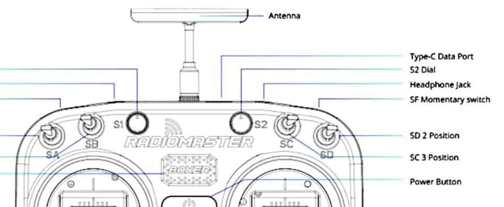
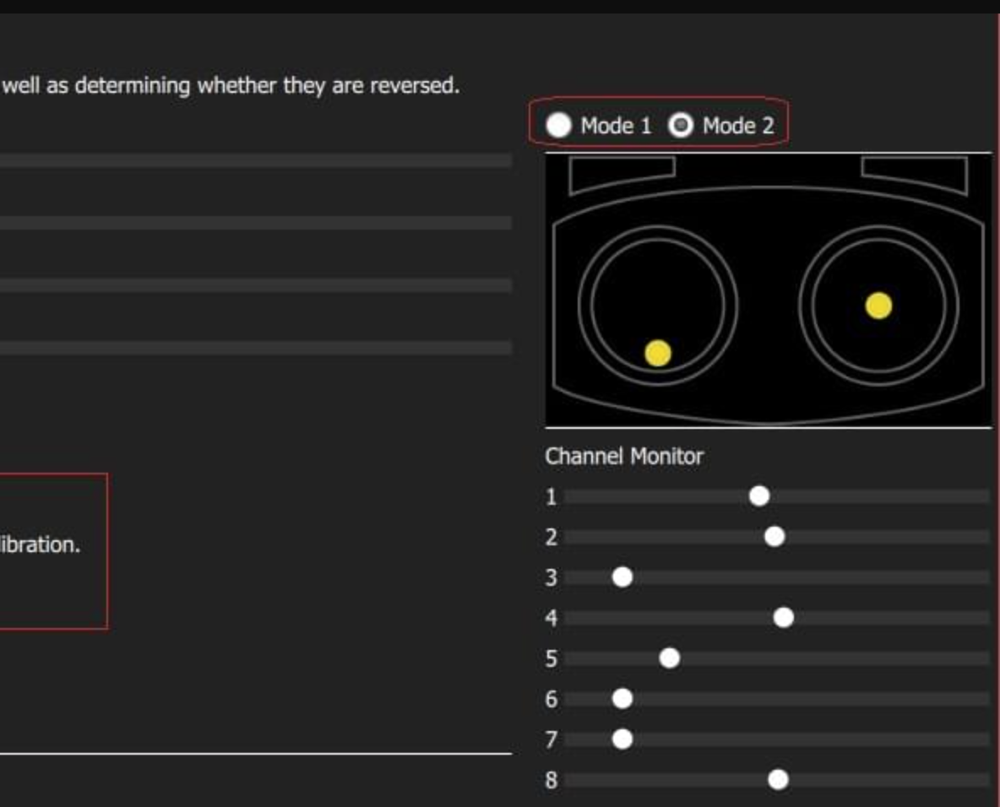

# Setup
```
git clone git@github.com:mamariomiamo/shiviz_px4_navigation.git && git submodule update --init --recursive
```
# Building
```
colcon build
```
# After launching PX4 gazebo sim
```
roslaunch px4_offboard px4_offboard.launch
```
# With actual drone
## Start offboard, auto-takeoff and mission using RC
Make sure RC is correctly setup as following:
### Channel 7
Channel 7 is a 3-position switch and will be used to control the state machine to go to ```TAKEOFF``` or ```MISSION``` mode.
### Channel 8
Channel 8 is a 2-position swtich and will be used to control the state machine to go to ```LAND``` or ```IDLE``` mode.
### Control logic
By default channel 7 and channel 8 should be both at upper position i.e with value 1000:
- Step 0: Set Mode Switch to POSITION Mode
- Step 1: Make sure the drone is clear from obstacles and in takeoff position.
- Step 2: Flip channel 7 switch to center position i.e. with value ~1500. Drone will automatically arm and takeoff.
- Step 3: After drone reaches takeoff height, flip channel 7 switch to bottom position i.e. with value ~1800. Drone will start to do waypoint mission.
- Step 4: After drone finishes waypoint mission, it will automatically land.
- Step 5: Flip channel 8 to bottom position.
- Step 6: Flip channel 7 to upper position.
- Step 7: Flip channel 8 to upper position to reset the state to ```IdLE```.
- Can repeat from Step 2 to trigger another round of auto-takeoff and mission.

Note:
If during mission, safety pilot can choose to flip channel 8 to bottom position to manually trigger the ```LAND``` state. Continue from Step 6 to reset the state and restart the mission.

Alternatively, safety pilot can toggle the mode switch to take over the control and manually control the drone in either POSITION or MANUAL mode.

### Radiomaster Boxer as an example
SC can be used as Channel 7 and SD can be used as Channel 8 (the two switches are at top right).

Make sure in the QGroundControl Flight Modes Channel Monitor, channel 7 and 8 moves when you toggle the switch.



### Launch command
```
roslaunch px4_offboard px4_offboard.launch use_rc:=true use_sim:=false
```
